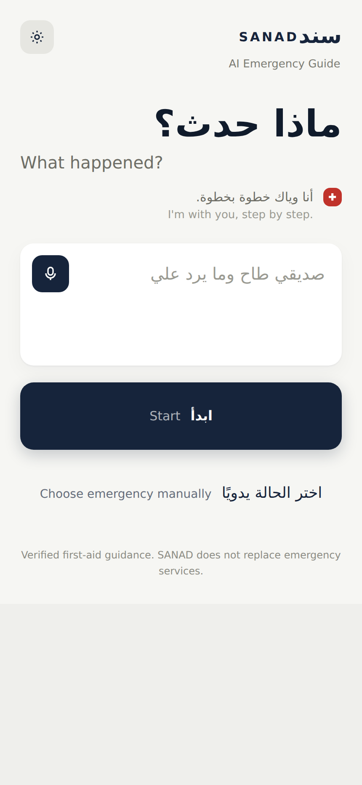
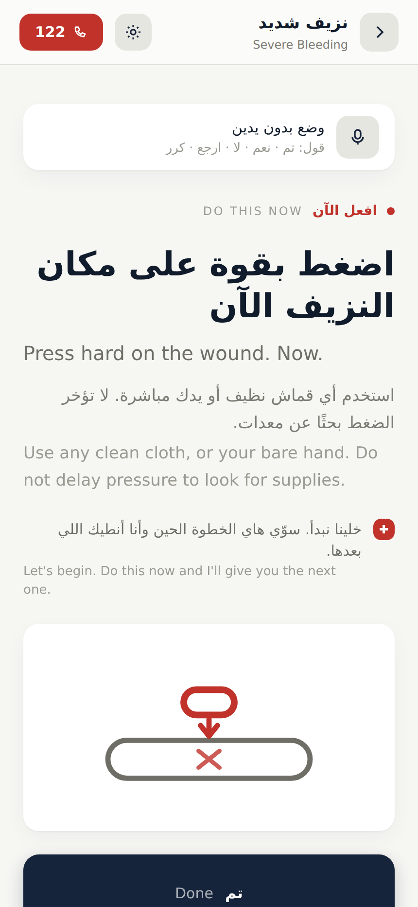
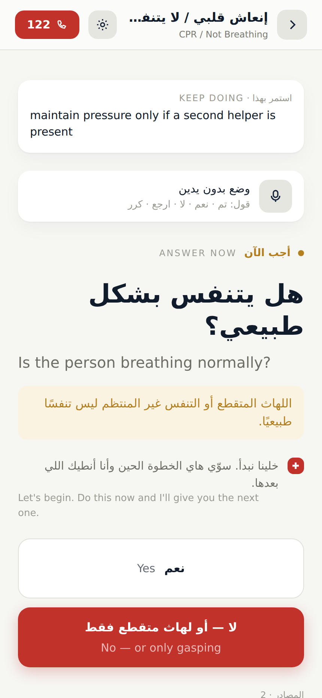

# SANAD — سند

**Verified, step-by-step first aid in Arabic and English. Works offline. The AI never writes the
medical advice.**

SANAD asks one question — *what happened?* — and walks a bystander through a single verified
instruction at a time, in Iraqi Arabic or English, on a phone with no signal. Ten emergencies are
covered, from severe bleeding to cardiac arrest, and the app moves between them on its own when
the casualty's condition changes mid-flow.

> ### ⚠️ This is not a medical device
>
> SANAD is a student project. It has **not** been reviewed or approved by any medical authority,
> hospital, or ministry of health. It does not replace emergency services, professional first-aid
> training, or a doctor. In an emergency, call your local emergency number first. The guidance is
> summarised from published NHS, American Red Cross, St John Ambulance and WHO protocols — each
> flow file cites its own sources — but no clinician has reviewed this implementation. Use it, read
> it, learn from it; do not deploy it to the public as authoritative medical guidance without
> qualified review.

<p align="center">
  
  
  
</p>

## Why it is built this way

Most "AI first-aid assistant" projects let a language model generate the advice. That is the one
thing this project refuses to do.

- **The model classifies. It never authors.** The AI's only job is to turn a panicked sentence into
  an emergency ID plus a confidence score, or one short clarifying question. It has no field in its
  tool schema for instructions, and anything resembling guidance is stripped server-side.
- **Mid-flow questions are answered by quotation.** If someone asks "can I put ice on it?", the
  model may only point at a sentence from the protocol already on screen. The server checks the
  quote is verbatim from the passages supplied, then shows *our* copy of the text — not the
  model's. A plausible paraphrase that flips a rule is rejected.
- **Nothing depends on the network.** It is an installable PWA: flows are bundled, not fetched. If
  the API is down, unreachable, or has no key, an offline keyword matcher takes over and the app
  never shows a raw error.
- **Ten emergencies, zero per-emergency code.** Every screen is a node rendered by one engine, and
  every emergency is a JSON file in `src/data/flows/`. Adding an eleventh is a file, not a commit
  to the app.

## Quick start

```bash
npm install
npm run dev          # http://localhost:5173
```

That is enough to use every one of the ten emergencies — no API key, no account. Classification
falls back to an offline keyword matcher and read-aloud uses the browser voice.

For AI classification, copy `.env.example` to `.env` and add one key (Groq's free tier is enough):

```bash
GROQ_API_KEY=gsk_...
npm run api          # the classifier server, on :8787
npm run check        # verifies the key, model, and speech provider
```

For real recorded speech instead of the browser voice, see
[Changing the voice](#changing-the-voice).

```bash
npm test             # engine, flows, matcher, classifier, voice, env, speech providers
npm run test:ui      # full click-through in headless Chromium
npm run test:offline # installs the service worker, kills the network, runs a case
npm run build
```

## Project layout

| Path | What lives there |
| --- | --- |
| `src/data/flows/` | The ten emergency JSON files — the medical source of truth |
| `src/engine/` | Framework-free state machine: refs, conditions, sessions, normalisation |
| `src/ai/` | Classifier client, offline matcher fallback, mid-flow participation |
| `src/voice/` | Read-aloud, speech input, hands-free step control |
| `server/` | Classifier API, provider adapters, speech providers, env loading |
| `scripts/` | Every test suite, plus `tts`, `voices` and `check` tooling |

## Status

| Phase | State |
| --- | --- |
| 1 — Emergency content | Done — 10 JSON flows, each citing published sources |
| 2 — Core engine | Done — one engine, all 10 cases, cross-flow transitions |
| 3 — Main UI | Done — one instruction per screen, bilingual, RTL/LTR |
| 4 — AI classifier | Done — id + confidence + clarification only, offline fallback |
| 5 — Voice | Done — read-aloud, speech input, hands-free step control |
| 6 — Safety & fallback | Done — installable, works fully offline, every failure path tested |
| 7 — Final polish | Ongoing — dark theme, transitions, diagrams, resume are in |

## Known gaps

Stated plainly, because they matter more than the feature list:

- No clinician has reviewed the flows. The content is sourced, not endorsed.
- Only Erbil's emergency number (122) is verified in `src/config/regions.js`; other regions must be
  configured by the user, and none are hardcoded.
- No field testing with real bystanders, and no evidence yet that it changes outcomes.
- `heatstroke.json` declares `id: heat_illness`, and a few referenced flows
  (`minor_cuts_and_grazes`, `chemical_burn`, `medical_haemorrhage`) are not authored yet — the
  engine degrades gracefully when a transition points at a missing flow, and `npm run validate`
  lists every such reference.

---

## 1. What the engine understands

### Node types
`instruction` · `question` · `monitor` · `loop` · `transition` · `rule` · `aftercare`

An unknown `type` is rendered as an instruction and reported as a warning — it never crashes.

### Reference grammar
Every forward pointer (`next`, any value in `answers`, any `watch_for[].goto`) is one of exactly
three shapes, parsed in a single place (`src/engine/refs.js`):

| Value | Meaning |
| --- | --- |
| `"some_node_id"` | jump inside the current flow |
| `"TRANSITION:CARDIAC_ARREST_CPR"` | cross-flow handover, key resolved in the flow's `transitions` |
| `"END"` | the flow is finished |

### State
`state` seeds the flow's variables. Entering a node applies its `sets` (with `"NOW"` resolved to a
timestamp) and its `increments`. Variables are kept **per flow**, so returning to a flow later keeps
what was already recorded.

### `skip_if`
Honoured only when the stored value maps unambiguously onto one of the node's own answers
(`true → "yes"`, `false → "no"`, or an exact string match), otherwise onto its `next`. If neither is
unambiguous, the question is asked again. One redundant question is always safer than a silently
wrong branch.

### `entry_action`
A flow with an `entry_action` (severe bleeding) starts there — care starts before any question is
asked, exactly as the JSON specifies with `fires_without_questions`.

### `classification.uncertain_behavior`
Already wired, ready for the AI classifier. Starting a session with `{ uncertain: true }`:
- `RUN_ENTRY_ACTION_THEN_CLARIFY` → fires the entry action, then diverts into the first
  `clarifying_nodes` entry instead of the normal `next`;
- otherwise uses `goto`, or the first clarifying node.

This is why `q_flow_character` / `q_pressure_response` / `q_shock_signs` are reachable at all — they
are the uncertain-entry path, not dead code.

### `global_escalations`
Triggers the condition evaluator can read (e.g. `dressings_soaked_count >= 2`) fire automatically and
raise an alert with a one-tap jump. Triggers it cannot read (`user_reports_unresponsive`) are always
offered as manual "the situation changed" buttons, because only the person on scene can observe them.

### Transitions
A `TRANSITION:*` never teleports silently. It shows an interstitial that states the reason
(`reason_ar` / `reason_en`), pins any `carry_over` instructions, and requires one tap. `carry_over`
text stays pinned at the top of every screen in the target flow.

Flows are held on a stack. Transitioning to a flow already on the stack **unwinds** to it instead of
nesting, so bleeding → CPR → breathing returns → CPR cannot grow forever.

### `monitor` / `loop`
`watch_for` entries render as observation buttons. A monitor with `loop.interval_seconds` gets a
countdown that offers its own `recheck_node` / `reassess_node` when it expires (severe bleeding's
10-minute circulation recheck). Any node whose `sets` includes `timer_started: true` gets a stopwatch
(seizure timing). Loop nodes whose text contains a rate range (`100–120`) get an optional audible
compression pacer — detected from the text, not hardcoded per node.

---

## 2. Graceful failure

Nothing about a malformed flow throws. Each failure has a designed screen:

| Situation | Result |
| --- | --- |
| `next`/answer points at a node that does not exist | **NODE_MISSING** screen: plain explanation, technical detail, "back to the previous step", call button |
| `TRANSITION:X` not declared in `transitions` | **BROKEN_REF** screen |
| Transition targets a flow that has not been authored | **FLOW_MISSING** screen naming the missing flow |
| Unknown node type | rendered as an instruction, logged as a warning |
| Node with no text / no exits | logged; the terminal panel is shown so the user is never stranded |
| `skip_if` chain that would loop | stopped after 20 hops |

`npm run validate` reports all of this per flow, and the in-app **Flow diagnostics** screen (home →
top right) shows the same report at runtime.

---

## 3. Emergency number policy

Never hardcoded. Resolution order:

1. a number the user set themselves,
2. `flow.emergency_number.regions[<region>]` (this is how Erbil's **122** reaches the button, with the
   KRG source attached),
3. `flow.emergency_number.number`,
4. the app's region table (`src/config/regions.js`),
5. nothing → the call bar says "number not set" and asks the user to enter their local one.

Every other Iraqi region ships as `null` on purpose: the flow data's own note says only 122 meets the
sourcing bar, and the rest must be verified with the Ministry of Health before release. Unverified
numbers are labelled as such under the call button.

---

## 3a. The design

The UI follows the SANAD prototype walkthrough: light (`#EFEFEC` page, white cards), one dark
primary action (`#16243B`), red (`#C0322A`) reserved for danger and the call button, amber for
"answer now", IBM Plex Sans Arabic + IBM Plex Sans.

Two decisions do most of the work:

1. **Every label is bilingual.** Arabic leads, the Latin echo sits beside it at 65% opacity. Nobody
   has to find a language switch mid-emergency, and a mixed-language household can both read it.
   The language setting only decides which one leads and the page direction.
2. **Everything configurable moved into one settings sheet** — language, text size, read-aloud,
   region. Home is a heading, a box, and a button; the guide screen is one instruction and its
   actions. Diagnostics live behind settings.

Tokens are in `src/index.css`, primitives in `src/components/ui.jsx`.

### Dark theme

Every Tailwind colour token points at a raw CSS variable (`--color-card: var(--c-card)`), and the
two palettes live in `:root` and `[data-theme='dark']`. Switching theme repaints the whole app by
changing one attribute — no rebuild, no duplicated classes, no `dark:` prefixes to keep in sync.
Settings offers **فاتح / داكن / تلقائي**; auto follows the OS and updates live if it changes.

The one deliberate inversion: the primary action is dark navy on light, near-white on dark
(`--c-brand` + `--c-on-brand`), so "the one thing to press" always reads as the strongest element.

### Switching language without the flicker

Changing language flips the entire document between RTL and LTR, which reflows every screen at
once — that was the glitch. Now the swap happens while the app is invisible:

- browsers with the View Transitions API get a real crossfade of the whole document
  (`document.startViewTransition` + `flushSync`, so React commits inside the transition);
- everything else gets a 170 ms blur-and-fade, with the DOM changing at the midpoint;
- `prefers-reduced-motion` skips straight to the swap.

Theme changes use the same path. A test asserts the app never gets stuck in the faded state.

### SANAD's own voice

The app now speaks, not just displays. `src/i18n/assistant.js` holds every line SANAD says in its
own voice — the greeting, "فهمت عليك", "راح أمشي وياك خطوة خطوة", how to answer a question, what to
do while monitoring — and the file carries one hard rule:

> Nothing in this file is medical. If a line here ever tells the user to *do* something to a
> casualty, it is a bug.

Instructions come only from the JSON flows. The assistant voice is the connective tissue around
them, and it only appears where it adds something: the first step of a flow, question screens, and
monitor screens. A silent step beats a filler line.

## 3b. Phase 3 — the UI

Three screens, nothing more.

**Home** — SANAD mark, "ماذا حدث؟ / What happened?", one text box with the mic inside it, Start, and
"اختر الحالة يدويًا". A gear opens settings. Nothing else.

**Manual selection** — the 10 cases as one grid of cards with an icon and a short name. Always
reachable, always works, never depends on anything that can fail. (Short names come from
`src/config/caseLabels.js`; the JSON's full clinical names are what you see inside the flow.)

**Emergency Mode** — a header with the case name and the red call pill, one instruction or question
per screen at 34px (44px on "large" text), 80px action buttons, and a footer with progress dots,
"ممنوع" (never-do) and read-aloud. Back steps backwards through the flow and walks out to home when
there is nothing left to undo.

### What Start does

Typed text goes to `classifyEmergency()` (§3c). Without a classifier endpoint, or whenever one
fails, it resolves locally with `src/match/localMatch.js` — an offline keyword matcher, **no AI, no
network**. It
indexes each flow's own `name`, `classification` signal lists and `example_user_descriptions`, plus a
small colloquial routing list in `src/match/routingKeywords.js`. Arabic is normalised (diacritics,
أ/إ/آ→ا, ى→ي, ة→ه) and scored with an IDF-style weight so "نزيف" counts for more than "صار".

Three outcomes, which are deliberately the same three the Phase 4 classifier will produce:

| Outcome | UI |
| --- | --- |
| `confident` | one case + confidence + "ابدأ الخطوات" |
| `ambiguous` | up to 3 candidates: "تقصد أي وحدة؟" |
| `no_match` / `empty` | message + the manual grid |

The matcher **only picks which verified flow to open**. It never generates guidance — same rule you
set for the AI in Phase 4. It stays in the build afterwards as the Phase 6 offline fallback.

### Progress indicator

Each node's shortest distance from its flow's start node is precomputed at load; the dots show
`depth / maxDepth`. It is "how deep are we", not a fake ETA — flows branch and loop, so a percentage
of remaining steps would be a lie.

### Voice controls

The microphone sheet (home) and the read-aloud toggle (Emergency Mode) are laid out and styled, and
say voice arrives in Phase 5 when used. Phase 5 replaces two handlers; no layout changes needed.

---

## 3c. Phase 4 — the AI classifier

The model answers exactly one question: **which flow, and how sure**. It never writes guidance.

```
browser                          server/classify.mjs                 provider
─────────────────────────────    ─────────────────────────────       ────────────────
classifyEmergency(text)   ──►    POST /classify  { text }      ──►   anthropic | mock
  ├─ classifyWithAI()                 strict tool schema
  │    └─ normalize + validate        + server-side sanitize
  └─ on ANY failure ─► localMatch.js (offline)
```

Run it:

```bash
npm run api        # mock provider — no key, no network, the whole path works
```

For real classification, copy `.env.example` to `.env` and put in one key:

```bash
GROQ_API_KEY=gsk_...          # free tier, OpenAI-compatible — the default choice
# or
ANTHROPIC_API_KEY=sk-ant-...
```

The provider is chosen from whichever key is present (override with
`SANAD_PROVIDER=groq|anthropic|mock`). Defaults: `openai/gpt-oss-120b` on Groq,
`claude-sonnet-4-5` on Anthropic; change with `SANAD_MODEL`.

**The key never reaches the browser.** It is read only by `server/classify.mjs`, is never
referenced under `src/`, and is never given a `VITE_` prefix — that would inline it into the
JavaScript every visitor downloads. `.env` is git-ignored in both locations.

### If the key isn't picked up

```bash
npm run check
```

It prints where the `.env` was found, which key names are in it (names only, never values),
which provider that selects, and whether the model and the TTS voice actually exist on that
key — so "no API key configured" stops being a guess.

The file can live in the project root **or** in `server/` next to the code that reads it; both
are checked, along with `.env.local` in either. Every candidate is read, so leaving the
placeholder line in the root and putting the real key in `server/.env` still works. The parser
also survives what editors do to text files: a UTF-8 BOM (Notepad and PowerShell add one, and it
would otherwise corrupt the first key's name), CRLF line endings, `export KEY=value` pasted from
a Linux guide, and quotes around the value. Values still reading `gsk_...` are ignored rather
than sent to the API, and anything already set in the shell wins over the file.

One thing the loader cannot see: on Windows, "Save As" from Notepad can produce `.env.txt`.
Turn on **View ▸ File name extensions** in Explorer and check the name is exactly `.env`.

`npm run test:env` covers all of the above.

Both providers are driven through the same forced tool call, and their two response shapes are
covered by tests (`server/providers.mjs` keeps the extractors pure): Anthropic returns parsed tool
input, Groq returns arguments as a JSON string, and a model that replies in prose instead of calling
the tool is treated as a failure. Because a retired model name fails exactly like a bad key from the
app's side, the server checks your key's model list at startup and names the alternatives it can
see.

**Three layers stop the model from becoming a medical author.** The tool schema has no field for
instructions; the server drops anything that is not one of our ten ids; and the browser
(`src/ai/classifier.js`) re-validates independently — unknown id → `no_match`, clarification that is
not a short question → dropped, every other key in the payload ignored. A test feeds it a payload
containing `"Apply butter to the burn"` and asserts none of it survives.

**Clarification instead of guessing.** Below 0.6 confidence, or when the model asks for it, the
result is `ambiguous`: one short question plus the candidate cases as buttons. The question must end
in `?` / `؟` and stay under 140 characters, and it may only ask about an observation.

**Failure is a normal path, not an error.** 503, HTML instead of JSON, a hung request, a wrong URL,
no endpoint at all — each falls through to the offline matcher and the user sees a normal result
labelled "مطابقة محلية / Offline match". No raw API error ever reaches the screen; the real reason is
logged server-side and kept in `result.aiError` for developers.

## 3d. Beyond the phases

Five things that turn a correct app into one that behaves like an assistant.

### It remembers who the casualty is

Choking asks "is this an infant?". If that infant then stops breathing, CPR must not stop to ask
again. `src/engine/sharedContext.js` holds the facts that stay true across flows; answering one of
them teaches every later flow, and the assumption is shown with a one-tap undo:

> اعتمدت إنه رضيع — ما سألتك مرة ثانية. **غيّر**

Only two mechanisms, both explicit and auditable: a question whose answers *are* the shared set
(CPR's adult/child/infant), and named nodes whose wording implies one value (choking's infant
question — "no" rules out infant but does not tell us adult vs child, so it teaches nothing).

### It survives a lock screen

Every step is written to storage. After a reload, Home offers to continue from the exact node with
all recorded state; it never auto-resumes, because a stale session silently reopening on step 9 of a
CPR flow is worse than starting clean. Anything older than two hours, or pointing at a flow this
build no longer has, is discarded.

### It tells you what to say on the phone

Tapping the call button dials **and** shows what the dispatcher is about to ask — case, casualty,
minutes elapsed, and what has already been done ("وضعنا عاصبة قبل 4 دقائق"), with a copy button.
Every line comes from `sets`/`increments` the flow itself recorded; `src/engine/handoverSummary.js`
reports facts and never advises.

### It draws the hard steps

Twelve schematic diagrams — hand placement for compressions, two fingers for an infant, back blows,
recovery position, tourniquet above the wound — mapped per node in `src/config/stepArt.js`. One
vocabulary: circle = head, rounded rectangle = body or hand, red = what you must do. A diagram may
only depict what the step's own text already says, and a step with no entry renders without one.
The full set is visible under Settings → Flow diagnostics.

### It works with no hands and no signal

See §3e and §3f.

## 3e. Phase 5 — voice

**Read aloud** speaks each step through `speechSynthesis`, preferring an Arabic voice.

**Hands-free** is the real feature. In a bleeding or CPR emergency both hands are on the casualty, so
SANAD reads the step, listens, and drives the same buttons the screen shows:

| Say | Effect |
| --- | --- |
| تم · خلصت · سويتها · اوكي · done · next | advance the step |
| نعم · ايه · اكيد · yes | answer yes |
| لا · كلا · no | answer no |
| the option itself — "ذراع أو ساق", "رضيع", "بالغ" | pick it |
| واحد · اثنين · ثلاثة · 1 · 2 · 3 | pick by position |
| ارجع · كرر · اتصل | back · repeat · call |

It is built to refuse rather than guess. A bare "لا" can never select "لا — أو لهاث متقطع فقط":
answers that change the whole course of care are in a high-stakes set that needs a clear match.
Ambiguous or unmatched audio does nothing at all and the screen simply waits. `npm run test:voice`
covers both halves — 31 checks, including the ones it must ignore.

Everything remains available by touch, always. If the browser has no speech, or the microphone is
refused, the bar says so in plain language and the app carries on.

## 3f. Phase 6 — offline and installable

SANAD is a PWA. The flow JSON is bundled into the build rather than fetched, so once the app has
been opened once, every case works with the network completely off — and the classifier already
falls back to the offline matcher.

`npm run test:offline` proves it end-to-end: install the service worker, cut the network, reload,
then run severe bleeding through a cross-flow transition into CPR and open the manual grid — all
with the network down.

## 3g. The AI during the emergency

Classification answers "which flow" at the door. That alone still felt like filling in a form, so
the model now takes part throughout — without ever being allowed to write medicine.

**Answer in your own words.** Every step has an input: type or speak what you can see. "الدم يفور من
رجله" presses the *spurting* option; "خلصت" advances. The model is sent only the options already on
that screen and may return one of those keys or null. Below 0.6 confidence, or on anything it does
not recognise, nothing happens and the buttons stay — a misread answer mid-CPR costs far more than a
repeated question. With no network, the same input is handled by the local command matcher.

**Ask mid-flow.** "أحط ثلج؟", "شكد أستمر؟" — answered with a sentence from the protocol you are
currently in, shown verbatim with its source, or refused:

> هذا مو موجود بالبروتوكول. لا أخمّن — اسأل الإسعاف على الخط.

The guarantee is enforced, not requested. The server sends the model a numbered list of sentences
from the loaded flow (`src/engine/passages.js`), and whatever it returns is checked against that
list: if the quote is not verbatim from a passage we supplied, the answer is thrown away, and the
text shown is **our copy** of the passage rather than the model's. Tests cover invented advice, a
plausible paraphrase that flips a rule, and a real quote with something appended
(`npm run test:participate`, 25 checks).

So the division stands: the model reads what you say and points at verified sentences; every word of
guidance on screen was written by a human and cites NHS, Red Cross, WHO or St John Ambulance.

## 3h. Voice that does not sound like a robot

Browser speech synthesis for Arabic is poor on most platforms. Since the flows are static, the
audio is pre-rendered instead of synthesised live:

```bash
npm run tts            # generate what is missing, into public/audio/
npm run tts -- --force # regenerate everything
```

Every node's spoken line is generated once with a real Arabic voice (Groq's Orpheus by default),
shipped as files, and played instantly — which also makes read-aloud work offline. Any step without
a clip falls back to the browser voice, so the app behaves the same whether or not you ever run it.

Voice and model are configurable (`TTS_MODEL_AR`, `TTS_VOICE_AR`). Voice names belong to the
model and change without notice, so the default is treated as a guess: if the API rejects it, the
error names the valid voices and the script switches to one of them and carries on. A voice **you**
set is never silently replaced — that stops with the list, because you asked for that voice.

### Changing the voice

Two different voices exist, and which one you are hearing decides where to change it.

**The browser voice** is used for any step without a pre-rendered clip — which is every step until
`npm run tts` has been run. Change it in the app: **Settings → Voice**, pick from the list, press
**Test**. The list is ranked, because platforms ship two generations of voice behind one API: the
old formant synthesisers (Windows' *Hoda*, *Naayf*) that produce the robotic drone, and modern
neural ones marked **Natural**, **Online**, **Neural**, **Premium** or **Enhanced**. There is no
quality field in the API, so the name and the local/remote flag are the only signals — those are
what the ranking uses, and the legacy names are actively pushed down. Choosing one is remembered
per language.

**Pre-rendered clips** are what `npm run tts` produces. To hear the options before spending quota
on 124 of them:

```bash
npm run voices                 # Arabic
npm run voices -- --lang en    # English
```

That asks your provider which voices the key can actually use, generates the same real instruction
with each, and writes `public/audio/samples/index.html` — open it, play them side by side, then
copy the `.env` line shown next to the one you want and run `npm run tts -- --force`. It costs one
sentence per voice instead of the ~9,500 characters a full run takes.

English clips are not generated by default. Set `TTS_LANGS=ar,en` before `npm run tts` if you want
recorded audio in both.

### Choosing a speech provider

SANAD needs **124 Arabic clips, about 9,500 characters**. That number decides everything below, and
it is why there is more than one option: Groq's free tier caps speech at **100 requests per day**,
so a free Groq key physically cannot finish in one run. Set one key; the provider follows
(`server/ttsProviders.mjs`, forced with `TTS_PROVIDER`).

| Provider | Key | Free allowance | Arabic |
|---|---|---|---|
| **Azure Speech** | `AZURE_SPEECH_KEY` + `AZURE_SPEECH_REGION` | 500k chars/month, no card, does not expire | **Iraqi** — `ar-IQ-RanaNeural`, `ar-IQ-BassemNeural` |
| ElevenLabs | `ELEVENLABS_API_KEY` | ~10k chars/month, **no commercial use** | Multilingual, MSA |
| Google Cloud | `GOOGLE_TTS_API_KEY` | Large, but billing must be enabled | MSA (`ar-XA`) |
| Groq | `GROQ_API_KEY` | 100 clips/**day** → two runs on two days | MSA (Saudi Orpheus) |

Azure is the recommendation for this project, and not on price: it is the only one that speaks
**Iraqi** Arabic rather than Modern Standard. Instructions shouted at a stranger in a crisis should
sound like the room they are in.

**Partial runs are normal and safe.** Every clip is written and added to the manifest as it
succeeds, so a rate limit, a dropped connection or Ctrl-C leaves working audio for everything done
so far, and the next run continues from there. Clips already on disk are never regenerated — not
even after switching provider, so nothing is paid for twice. Steps without a clip use the browser
voice, per step, with no visible failure.

Failures are separated by whether a retry can fix them. A short `retry-after` is waited out; a
daily cap stops the run and says how to continue; a terms click, a rejected key or a missing model
stops at the *first* clip with the specific fix rather than repeating itself 124 times. `npm run
check` asks your provider for one word of audio before you start, so terms, region and voice-name
problems surface in a second rather than mid-run. All of it is covered by `npm run test:tts` (36
checks) against a stub that imitates each API, including the rate-limit and partial-manifest paths.

## 4. Adding an emergency

Drop the JSON file into `src/data/flows/`. That is the entire process — no registration, no route, no
component. `npm run validate` will tell you immediately if any reference in it is broken.

---

## 5. Verification performed

- `npm run validate` — 10 flows, 124 nodes, **0 structural errors**; every `next`, answer,
  `watch_for` and `TRANSITION:` reference resolves.
- `npm run test:flows` — **32/32 checks**. Includes an exhaustive walk that presses every button on
  every reachable screen (**120 screens, 77 cross-flow transitions exercised**) and asserts none of
  them reaches a broken state; the milestone paths; carry-over survival; stack unwinding; and
  deliberately malformed flows degrading to the right screens.
- `npm run test:match` — **24/24** realistic Iraqi-Arabic and English descriptions routed to the right
  flow, and **3/3** vague inputs correctly *not* auto-started.
- `npm run test:ai` — **19/19** classifier checks: payload validation, model-authored guidance
  discarded, clarification rules, and every endpoint failure mode (503 / HTML / timeout /
  unreachable) falling back to the offline matcher with no raw error surfacing.
- `npm run test:participate` — **25/25** checks on the in-emergency AI: the verbatim guarantee
  (invented advice, flipped rules and doctored quotes all rejected), question-vs-answer routing, and
  the offline behaviour of both.
- `npm run test:voice` — **31/31** hands-free checks: the phrases it must understand, and the ones
  it must refuse to act on.
- `npm run test:offline` — **10/10** offline checks: service worker, manifest, and a full case run
  with the network off.
- `npm run test:ui` — real Chromium click-through with the classifier API running in mock mode,
  **26/26 checks**, zero console errors: home → describe → AI classify → Emergency Mode → the full
  milestone (bleeding → tourniquet → shock care → response → breathing → CPR) → never-do → pacer →
  settings/text size → manual grid → another case → English/LTR → desktop. Screenshots in
  `screenshots/`.

### Milestone path proven end-to-end

```
severe_external_bleeding/__entry_action__ → call_emergency → q_embedded_object → instr_apply_dressing
→ instr_circulation_check → q_bleeding_uncontrolled → q_wound_site → q_tourniquet_available
→ instr_wound_packing → shock_care → instr_keep_warm → check_response → instr_open_airway
→ check_breathing → PENDING:CARDIAC_ARREST → cardiac_arrest_cpr/q_breathing_normal
```

and the breathing-normally branch: bleeding → `unresponsive_breathing` → (breathing stops) →
`cardiac_arrest_cpr` → AED → `continue_cpr`, with the stack unwinding to depth 3 rather than nesting.

---

## 6. Content notes found while wiring the data

These are data observations, not code bugs. Nothing was changed in your JSON.

1. **`severe_external_bleeding.q_wound_site` has `skip_if: "wound_site != null"`, but no node ever
   sets `wound_site`.** The condition can never fire, so the site question can be asked twice if the
   flow returns through `q_dressing_soaked`. Fix by adding `"sets": {"wound_site": "<value>"}` to the
   branch targets, or drop the `skip_if`. The validator flags this as `condition_var_never_set`.
2. **`choking.visible_object_rule`** is a `rule` node nothing points at. It currently renders only if
   reached directly. Consider surfacing it as a standing rule on the choking screens (like `never_do`).
3. **Three flows are referenced but not authored**: `minor_cuts_and_grazes` (from `MINOR_WOUND`),
   `medical_haemorrhage`, and `chemical_burn`. They resolve to the unavailable-flow screen today.
4. **`heatstroke.json` declares `id: "heat_illness"`** — the engine keys on the `id`, not the
   filename, so this works, but the mismatch is worth knowing.
5. `poisoning` and `heat_illness` both transition to `seizure`, and `seizure` transitions back into
   CPR / unresponsive-breathing — the stack-unwinding rule is what keeps those cycles bounded.

---

## 7. Layout

```
src/
  engine/            framework-free, testable in Node
    refs.js          the only place TRANSITION:/END strings are parsed
    conditions.js    tiny evaluator for skip_if and escalation triggers
    normalizeFlow.js raw JSON -> one canonical shape + issue list (never throws)
    flowRegistry.js  loads all flows, cross-checks transition targets
    session.js       the state machine: advance / transitions / stack / history
    emergencyNumber.js
  components/        node renderers, call bar, interstitial, failure screens
  screens/           Home (manual test buttons), Emergency Mode, Diagnostics
  data/flows/*.json  the source of truth
scripts/             validate-flows, traverse-flows (engine tests), ui-smoke
```

## 8. Next step (Phase 5 — voice)

Two handlers, no layout work:

- `src/components/MicSheet.jsx` — replace the placeholder body with Web Speech recognition, put the
  transcript in Home's textarea, and run the same `classifyEmergency()` on it. Speech → text → the
  existing classifier; nothing else changes.
- `src/screens/EmergencyScreen.jsx` — the read-aloud toggle already stores a real setting
  (`readAloud`); speak the current node's primary text with `speechSynthesis` when it is on.

Text must keep working with voice off — it already does, and the tests assert it.

Phase 6 is then mostly verification of behaviour that is already in place and covered by tests:
manual selection never touches the network, flows are bundled locally, the emergency number is
region-configured, transitions are exercised, malformed nodes have designed screens, and API failures
degrade silently to the offline matcher.
